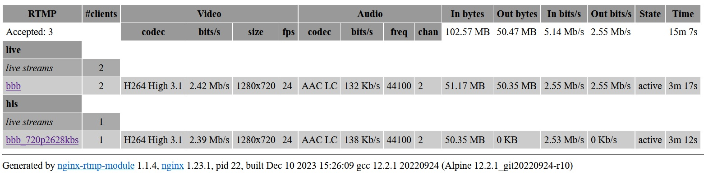
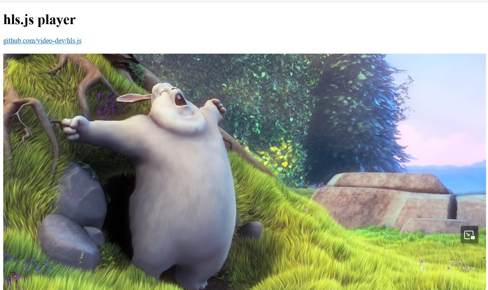

# rtmp-ffmpeg-rockchip-arm32v7-fast-fast

Same as rtmp-ffmpeg-rockchip-arm32v7 but using pre-compiled libs.

nginx-rtmp and ffmpeg static compiled for arm32v7 with rockchip-mpp, alsa and pulse.

It should work on another arm Rockchip machines too.

Inspired by:

https://github.com/hbiyik/FFmpeg

https://github.com/jjm2473/ffmpeg-rk

https://github.com/wader/static-ffmpeg

https://github.com/alfg/docker-nginx-rtmp

## How to build?

- get an armv7 device with Rockchip CPU (tested on rk322x);
- install Armbian;
- install docker;
- install docker-compose;
- install git and then...

````
git clone https://github.com/primoitt83/rtmp-ffmpeg-rockchip-arm32v7-fast.git

cd rtmp-ffmpeg-rockchip-arm32v7-fast

docker-compose up -d
````

## Can I build on x86_64 machine?

Yes, but you need to build image first then use compose:

````
git clone https://github.com/primoitt83/rtmp-ffmpeg-rockchip-arm32v7-fast.git

cd rtmp-ffmpeg-rockchip-arm32v7-fast

docker run --rm --privileged multiarch/qemu-user-static --reset -p yes

docker build --pull --no-cache --rm=true -f ./build/Dockerfile_x86 -t rtmp:rockchip .

docker-compose -f docker-compose-x86.yml up -d
````

## How to test?

With nginx-rtmp image ready, you can shoot ffmpeg from it like this:

Remember to change image name as need it:

````
armv32v7: rtmp-ffmpeg-rockchip-arm32v7-fast_rtmp:latest

x86: rtmp:rockchip
````

````
docker run -i --rm \
    -w "$PWD" \
    --cap-add=SYS_ADMIN \
    -v $PWD:/tmp \
    --name test \
    rtmp-ffmpeg-rockchip-arm32v7-fast_rtmp:latest \
    ffmpeg -buildconf
````

720p video scale to 360p (too slow on x86 machine emulating arm32v7)
````
curl -k http://commondatastorage.googleapis.com/gtv-videos-bucket/sample/BigBuckBunny.mp4 -o BBB.mp4

docker run -i --rm \
    -w "$PWD" \
    --cap-add=SYS_ADMIN \
    -v $PWD:/tmp \
    --name test \
    rtmp-ffmpeg-rockchip-arm32v7-fast_rtmp:latest \
    ffmpeg -y -c:v h264 -i /tmp/BBB.mp4 \
    -an \
    -c:v libx264 -vf scale=w=640:h=360 \
    -f mp4 /tmp/test.mp4
````    

Create hls stream from BBB video (works good on x86 too)

Armbian ip: 192.168.5.99
````
docker run -i --rm \
    -w "$PWD" \
    --cap-add=SYS_ADMIN \
    -v $PWD:/tmp \
    --name test \
    rtmp-ffmpeg-rockchip-arm32v7-fast_rtmp:latest \
    ffmpeg -re -stream_loop -1 -i /tmp/BBB.mp4 \
    -c: copy -tune zerolatency \
    -f flv rtmp://192.168.5.99:1935/live/bbb
````  

Now you can check the stats:

http://192.168.5.99/static



And the streaming:

http://192.168.5.99/player.html?url=http://192.168.5.99/live/bbb.m3u8



Capture from a webcam and use rockchip hardware to encode:

Armbian ip: 192.168.5.99

````
docker run -i --rm \
    -w "$PWD" \
    --cap-add=SYS_ADMIN \
    --device=/dev/video0:/dev/video0 \
    --device=/dev/snd:/dev/snd \
        `for dev in iep rga dri dma_heap mpp_service mpp-service vpu_service vpu-service \
            hevc_service hevc-service rkvdec rkvenc avsd vepu h265e ; do \
        [ -e "/dev/$dev" ] && echo " --device /dev/$dev"; \
    done` \
    -v "$PWD":/tmp \
    rtmp-ffmpeg-rockchip-arm32v7-fast_rtmp:latest \
    ffmpeg -y -hwaccel drm -hwaccel_device /dev/dri/renderD128 \
    -f alsa -thread_queue_size 12000 -i sysdefault:CARD=CameraB409241 \
    -f v4l2 -thread_queue_size 12000 -i /dev/video0 \
    -c:a libfdk_aac -strict -2 -ab 64k -ar 44100 -ac 2 \
    -c:v h264_rkmpp_encoder -quality_min 4 -quality_max 48 -b:v 2500k -maxrate 2500k -bufsize 5000k -pix_fmt yuyv422 -r 30 -g 30 \
    -f flv rtmp://192.168.5.99:1935/live/room
````

Now you can check the stats:

http://192.168.5.99/static

And the streaming:

http://192.168.5.99/player.html?url=http://192.168.5.99/live/room.m3u8